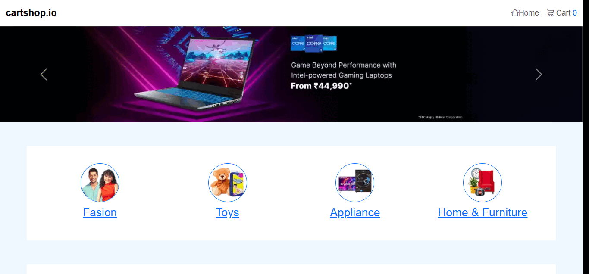

 🛒 E-commerce Application

An Angular-based e-commerce web application showcasing modern frontend development practices, clean UI, and seamless user experience.

## 🚀 Live Demo

Check out the live version here:  
🔗 [https://ecommerce-app-six-sepia.vercel.app/](https://ecommerce-app-six-sepia.vercel.app/)

---

## 🛠️ Getting Started

Follow the steps below to run the project locally.

### 1. Clone the Repository

```bash
git clone https://github.com/belal-Salah1/Ecommerce-app.git
cd Ecommerce-app


###2. Install Dependencies

npm install

###3. Run the Development Server

ng serve
Navigate to http://localhost:4200/ in your browser. The app will automatically reload if you change any of the source files.
